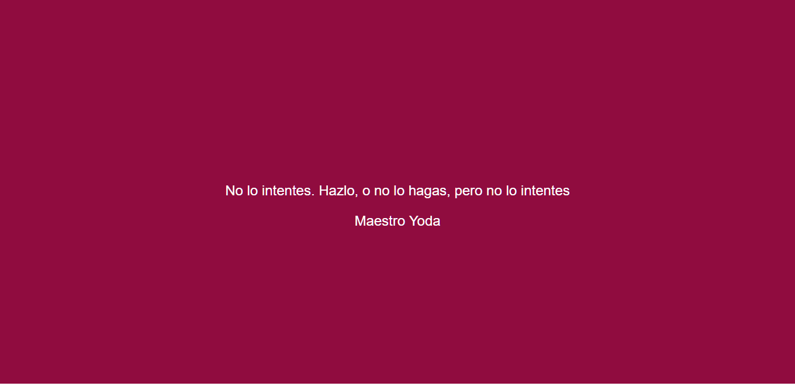
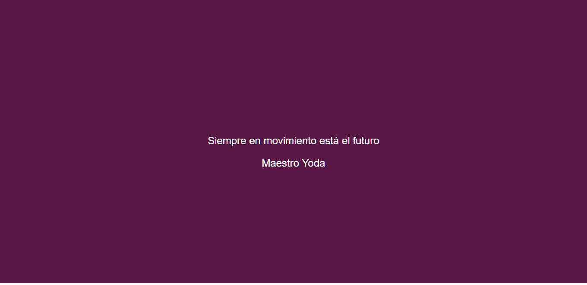

# Random Box
Es un proyecto que se encarga de mostrar un mensaje y un color de fondo diferente cada vez que se recarga la página.

### Detalles del proyecto

+ Este proyecto fue desarrollado con la librería *React*, ya que se quiere aprender su uso a tráves de este ejercicio.
+ El proyecto muestra 5 frases diferentes , todas ellas de personajes de Star Wars como el Maestro Joda, Obi Wan, etc.
+ El proyecto muestra 5 colores de fondo diferentes.